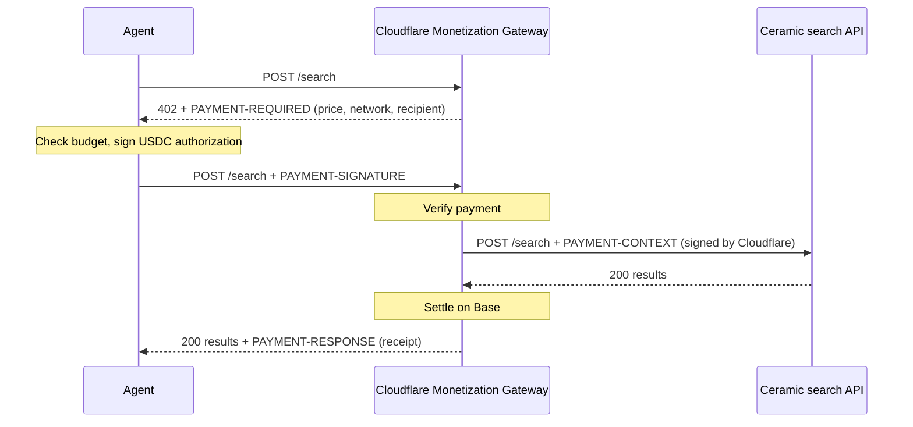

# x402 search agent

An AI agent that pays for each web search it runs, with no account and no API key.

[Ceramic's search API](https://api.ceramic.ai/search) accepts payment per request through the [Cloudflare Monetization Gateway](https://blog.cloudflare.com/monetization-gateway/) using [x402](https://x402.org), an open protocol for paying over HTTP. When a request arrives without payment, the Gateway answers `402 Payment Required` with a price. The client signs a USDC payment, retries, and gets results. Each search currently costs **0.001 USDC** (a tenth of a cent) on Base.

```
$ npm run agent -- "How close are solid-state batteries to mass production?"
Thinking…
→ search "solid-state battery mass production timeline"  paid 0.001 USDC  https://basescan.org/tx/0x90ea…
→ search "Toyota solid-state battery 2027"               paid 0.001 USDC  https://basescan.org/tx/0x4c1b…
→ search "QuantumScape production update"                paid 0.001 USDC  https://basescan.org/tx/0xd27e…

Solid-state batteries are close but not yet at mass scale. Toyota is targeting… [1]

3 paid searches, 0.003 USDC total, 0.047 USDC left in this run's budget
```

## Quick start

You need Node.js 20 or later, and about $1 of USDC on Base.

```bash
git clone https://github.com/CeramicTeam/ceramic-x402-search-agent && cd ceramic-x402-search-agent
npm install
npm run wallet:new     # creates a demo wallet and saves its key to .env
```

Fund the wallet (see below), add an `ANTHROPIC_API_KEY` to `.env` if you want to run the agent, then check everything:

```bash
npm run doctor
```

```
✓ Wallet 0x7Ab3…91cE
✓ USDC on Base: 1
✓ https://api.ceramic.ai/search asks for 0.001 USDC per search on eip155:8453
✓ Anthropic API key works

Ready. Try: npm run search -- "latest on solid-state batteries"
```

## Funding the wallet

Send a small amount of **USDC on Base mainnet** to the address `wallet:new` printed. $1 covers about a thousand searches.

- **From an exchange:** withdraw USDC and choose **Base** as the network. Coinbase supports this directly.
- **From another wallet:** send USDC on Base to the demo address.

You don't need ETH for gas. x402 payments are signed authorizations, and the Gateway submits and pays for the on-chain transfer. Make sure the USDC is on Base mainnet. USDC on Ethereum, another chain, or a testnet won't work, and `npm run doctor` will tell you if the balance is zero.

## The examples

There are three ways to run a paid search, from most explicit to most useful.

### 1. `npm run curl-demo`: the protocol, step by step

A shell script that runs the whole exchange with `curl` so you can see every header:

1. Search without paying and get a `402` with a `PAYMENT-REQUIRED` header describing the price.
2. Sign a USDC `TransferWithAuthorization` (EIP-3009) locally with [Foundry's `cast`](https://getfoundry.sh).
3. Search again with the payment in a `PAYMENT-SIGNATURE` header and get results, plus a `PAYMENT-RESPONSE` receipt.

It needs `curl`, `jq`, `openssl`, and `cast` (`curl -L https://foundry.paradigm.xyz | bash && foundryup`). Set `QUERY="…"` to change the search.

### 2. `npm run search -- "your query"`: one paid search

Uses the official x402 client. Paying is a one-line change to `fetch`, and [`examples/minimal.ts`](examples/minimal.ts) shows exactly that in about fifteen lines:

```ts
const client = new x402Client();
registerExactEvmScheme(client, { signer: privateKeyToAccount(process.env.PRIVATE_KEY) });
const fetchWithPayment = wrapFetchWithPayment(fetch, client);

const res = await fetchWithPayment("https://api.ceramic.ai/search", {
  method: "POST",
  headers: { "Content-Type": "application/json" },
  body: JSON.stringify({ query: "solid-state batteries" }),
});
```

`npm run search` adds the spending caps described below and prints a Basescan link for each payment.

### 3. `npm run agent -- "your question"`: a research agent

A Claude agent with a `search` tool. It decides what to search for, pays for each search, and answers with cited sources. The agent is a plain tool-calling loop in [`src/agent.ts`](src/agent.ts), with no framework, so the payment path is easy to follow. To use a different model, change `MODEL` in `.env`, or swap the Anthropic call for another provider's.

## Spending caps

Every paid search goes through a budget that is checked **before anything is signed**:

| Setting | Default | Meaning |
|---|---|---|
| `MAX_USDC_PER_SEARCH` | `0.01` | The most one search may cost. A pricier search is refused. |
| `MAX_USDC_PER_RUN` | `0.05` | The most one command may spend in total. The agent stops searching when it's reached. |

The caps are enforced inside the wallet signer that the x402 client calls (see [`src/search.ts`](src/search.ts)), so a payment over budget is never signed, rather than being signed and then discarded. A payment only counts against the budget once the Gateway confirms it settled. Failed searches aren't charged, and don't use up the budget.

`examples/minimal.ts` deliberately has no caps, to stay short. Use `src/search.ts` as the starting point for real code.

## How it works



- **Ceramic's API never handles money.** It returns a `401` for unpaid requests, which the Gateway turns into a `402` with a price. For paid requests, it only checks a short-lived token signed by Cloudflare that says the request was paid.
- **The client never shares its key.** It signs a one-time authorization for exactly the quoted amount to the quoted recipient, valid for a limited window.
- **Settlement happens only after success.** The Gateway doesn't settle responses with an error status, so a failed search costs nothing.

## Configuration

All settings live in `.env` (copied from [`.env.example`](.env.example) by `wallet:new`):

| Variable | Required for | Default |
|---|---|---|
| `PRIVATE_KEY` | everything | created by `npm run wallet:new` |
| `ANTHROPIC_API_KEY` | `agent` | none |
| `MAX_USDC_PER_SEARCH` | | `0.01` |
| `MAX_USDC_PER_RUN` | | `0.05` |
| `SEARCH_URL` | | `https://api.ceramic.ai/search` |
| `MODEL` | | `claude-sonnet-5` |
| `BASE_RPC_URL` | `doctor` (balance check) | `https://mainnet.base.org` |

## Troubleshooting

**`facilitator rejected verify request` (HTTP 400).** The payment was refused before your search ran, and nothing was charged. The usual cause is no USDC on Base mainnet in the wallet, or funds on the wrong network. Run `npm run doctor`.

**`Stopped before paying: …`** A spending cap stopped the payment before it was signed. Raise `MAX_USDC_PER_SEARCH` or `MAX_USDC_PER_RUN` if you're happy with the price.

**`No PRIVATE_KEY in .env`.** Run `npm run wallet:new`.

**`curl-demo` can't find `cast`.** Install Foundry with `curl -L https://foundry.paradigm.xyz | bash && foundryup`, then open a new terminal.

**Browser apps.** These examples run server-side. Calling the API directly from a web page on another origin is currently blocked by CORS, so call it from a backend (as here) instead.

## Security

- Use the demo wallet `wallet:new` creates, not a wallet holding real savings. Fund it with only what you plan to spend.
- `.env` is gitignored. Never commit it or paste its contents anywhere.
- Every payment prints its Basescan link, so you can check exactly what was spent.

## License

MIT
